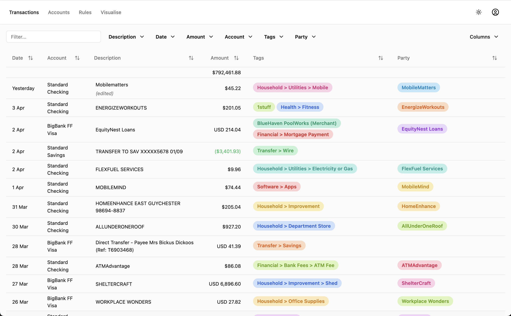
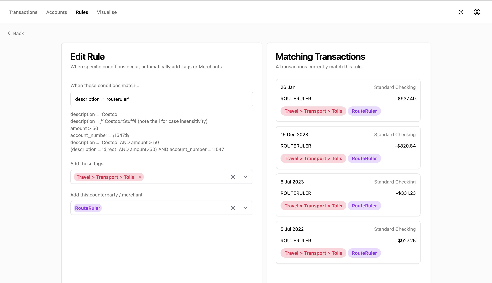
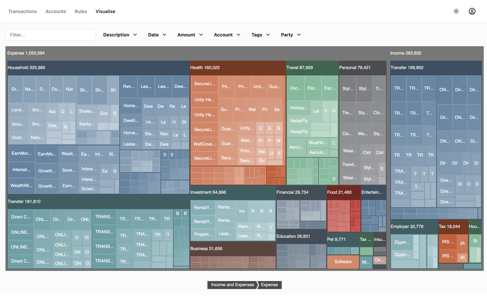
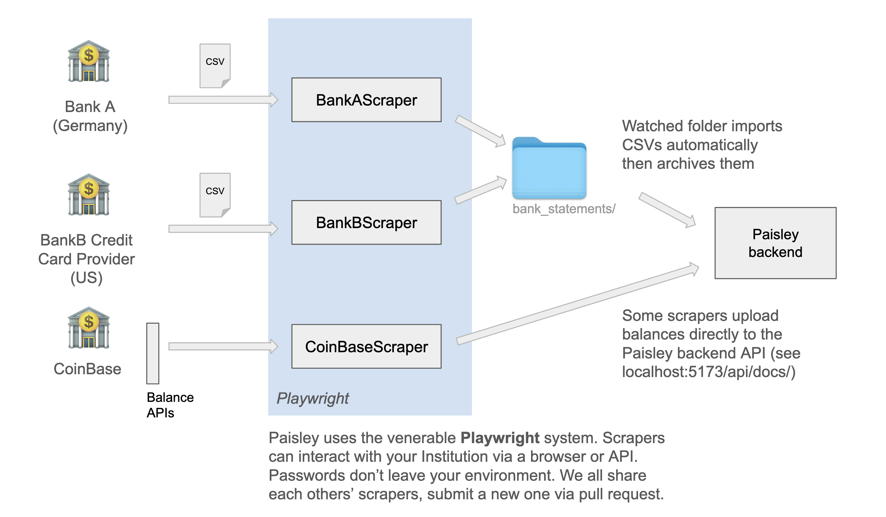

# Paisley - Locally Hosted Personal Finances

Paisley is a personal finance, banking, and asset tracker — all in one.
Gain a clear, holistic view of income, expenses, and total net worth across all accounts, assets, and liabilities.

Need to track down hidden subscriptions scattered across multiple banks or cards?
Curious how much went toward groceries last month?
Paisley makes it easy.







## How does it work?

Paisley pulls data from your financial institutions by scraping balances and importing CSV exports, storing everything locally in a simple SQLite database.

For banks without scrapers (or where scrapers are flaky), just drop CSV files into a watched folder. Each institution gets its own csv_parser — a lightweight import script that maps raw CSVs into a normalized format.



Once transactions are imported, a Rules engine will apply your rules to auto-categorize the transactions. For example:


For `description = '7-eleven' and amount < 20` apply tag `Food > Snacks` and party `7-Eleven`

For `description = '7-eleven' and amount > 20` apply tag `Travel > Car > Fuel` and party `7-Eleven`

## Motivation. Who is this for?

Ever found yourself wrangling CSVs in a spreadsheet just to search or categorize transactions? Or manually tracking bank balances to keep tabs on net worth? Yeah, same.

Banking search tools are stuck in the '80s. They're borderline useless.

I managed a spreadsheet to track my net worth for over a decade. Eventually, I got tired of the manual grind, started scripting transaction and balance downloads, and dumped everything into a SQLite database. That setup evolved into what is now Paisley.

Paisley is designed to be simple, but it really shines for technically inclined folks who are ready to automate their financial tracking — no cloud, no middlemen, just clean local data.

It runs on your home network, always local.

Why the name Paisley? Because it’s the opposite of Plaid. I’m not handing over my bank credentials — and neither should you.

What is Paisley not trying to do?

 - Paisley is not a personal budgetting tool. I firmly believe that most people just need a crystal clear view of their finances and then personal accountability will prevail.

 - Paisly is not attempting to be an accounting platform. Accordingly, you are limited in transaction editing because your bank is considered the source of truth. If you need to edit dates or make bulk edits on transactions then your importer needs to be fixed.

## Features
 - Runs on your home network. No bank passwords in the cloud.
 - Scrapes CSVs from your banks and financial institutions at scheduled intervals (cron format)
 - Paisley accepts all currencies and languages. Currently 4 spoken languages are supported. The goal is that you can hold accounts in different countries and see an account balance in a single currency.
 - You can use the pre-built scrapers from the paisley library (which will grow over time), or you can write your own scraper using [playwright](https://playwright.dev/) which is an excellent web automation tool. Some scrapers are as few as 20 lines of automation code to login and download the CSV [like this one](https://github.com/patrickcollins12/paisley/blob/90818e236aa554fafa577577f7616c54b10b6196/backend/scrapers/commsec.js)
 - Paisley automatically dedupes transactions, so feel free to just keep downloading CSV files and throw them into the watched folder.
 - Transactions can be categorized into `tags`. This can be done automatically with flexible rules or manually by you. e.g. "Health > Services > Family Doctor" 
 - Paisley has a tree-map view of your financial transactions which you can filter.
 - Paisley has a detailed view of all of your accounts where you can setup your entire asset and liability base.

# Install and setup
Setup is fairly straight forward, but is currently manual... maybe one day I'll make a docker container, but so far I prefer this lighter approach. 

If you're interested in the details, Paisley runs as a NodeJS application with two main server processes: a Vite React frontend webserver and an Express server backend. They both are hosted at `localhost:5173` (the backend is proxied through as `/api`).

## Step 1: Update to at least node v22. 
Best way is to install and use [nvm](https://github.com/nvm-sh/nvm)

```
$ node --version
$ nvm use latest  # or, nvm use 22
$ nvm alias default 'lts/*'
$ nvm install --lts
```

## Step 2: Install sqlite3
Install sqlite3. For instance:

`$ brew install sqlite3` 

OR

`$ sudo apt install sqlite3`

## Step 3: Install and try the paisley demo instance
```
$ gh repo clone patrickcollins12/paisley
$ cd paisley
$ npm install
$ npm run demo
```

On install you'll see `npm warn deprecated` - you can ignore these warnings
On install, the setup script also created some default files in `~/paisley`

## Step 4: open paisley

Open http://localhost:5173

Login to the demo instance with the admin account (username: `admin`,  password: `admin`)

You're running! You will be presented with demo data. Take a look around.

# Setting up paisley

Setting up paisley requires a few steps. 

## Create a user
```
$ node backend/bin/user.js --user="yourname" --password="mypassword"
```

By default this will use the user.js file as defined in your config.js. Normally at ~/paisley/users.json

## Review the config file

```
cat ~/paisley/config.js
```
## Install Playwright
```
$ cd backend 
$ npx playwright install
```

## Start the server
``` 
$ npm run start
```

(or in development mode: ` $ npm run dev `)

## Auto start on reboot
To auto start on system boot you can use pm2.

Install [pm2](https://pm2.io/docs/runtime/guide/installation/)

```
npm install pm2 -g                         # install pm2
pm2 start npm --name paisley -- run start  # setup paisley in pm2 and start it
pm2 save                                   # save the results
pm2 startup                                # Set startup scripts. Follow the instructions.
```

To manually control pm2 try:  `pm2 restart paisley` also stop, start and list.

pm2 pipes all console output to it's own log files `pm2 paisley logs`, or just watch the paisley log files:
```
tail -f ~/paisley/logs/paisley.log
```

## Process a CSV

Write a csv_parser by cloning one of the existing parsers.

Drop your CSV into ~/paisley/bank_statements

It should automatically get imported.

## Running your scrapers

Scrapers should run automatically on a cron schedule as defined in `config.json` but you can run it manually:

```
$ cd backend
$ npx playwright test
```

or choose to run a single scraper

```
$ npx playwright test westpac
```

or choose to run a single scraper in headed mode:

```
$ npx playwright test westpac --headed
```

disable retries:

```
$ npx playwright test westpac --headed --retries=0
```

## Creating your own scraper

```
npx codegen 'https://my_bank.com/'
```

click around, login, get to the CSV and hit the download button.

Copy the script that comes from that, then grab one of the existing scrapers like commsec.js and merge the two together.

More help to come on this.
